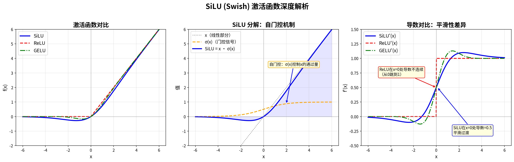

# SiLU (Swish) 激活函数深度笔记



## 公式

$$
\text{SiLU}(x) = x \cdot \sigma(x) = x \cdot \frac{1}{1 + e^{-x}} = \frac{x}{1 + e^{-x}}
$$

也叫 **Swish**，Google Brain 2017 年发现。

## 它是怎么被发现的？

Google Brain 的论文 *"Searching for Activation Functions"* (Ramachandran et al., 2017) 用了一种暴力美学的方法：

1. 定义一个激活函数的"搜索空间"：把 `x`, `σ(x)`, `tanh(x)`, `max(x,0)` 等基本函数用 `+`, `×`, `max` 等运算组合
2. 穷举了 **上万种** 候选组合
3. 在多个任务（图像分类、机器翻译等）上训练比较
4. 结果：`x · σ(x)` 在几乎所有任务上都 **稍微但一致地** 优于 ReLU

就是这么简单粗暴——"搜"出来的，不是人拍脑袋设计的。

## 为什么 SiLU 比 ReLU 好？

### 1. 负值区域有小负输出（非单调）

| 特性 | ReLU | SiLU |
|------|------|------|
| x < 0 时 | 直接输出 0（完全丢弃） | 输出一个小负值（保留信息） |
| 最小值 | 0 | ≈ -0.278 (在 x ≈ -1.28 处) |

ReLU 在 x < 0 时输出恒为 0，这导致了 **"死神经元"** 问题——一旦某个神经元的输入持续为负，它就永远输出 0，梯度也为 0，再也学不回来。

SiLU 在 x < 0 时仍然有小的非零输出和非零梯度，不会彻底"死掉"。

### 2. 处处可导，导数平滑

$$
\text{SiLU}'(x) = \sigma(x) + x \cdot \sigma(x) \cdot (1 - \sigma(x)) = \sigma(x) \cdot (1 + x \cdot (1 - \sigma(x)))
$$

| 特性 | ReLU | SiLU |
|------|------|------|
| x = 0 处 | 导数不连续（断崖式 0→1） | 导数 = 0.5（平滑过渡） |
| 梯度流 | 粗糙 | 平滑 |

平滑的梯度意味着优化器的更新方向更稳定，训练更容易收敛。

### 3. "自门控"机制

SiLU 可以拆解为：

```
SiLU(x) = x × gate(x)
           │      │
         输入    sigmoid(x) ∈ (0, 1)
```

- `sigmoid(x)` 充当"门"：x 大时门≈1（放行），x 很负时门≈0（抑制）
- 这和 LSTM/GRU 的门控机制本质相同——模型自己决定"让多少信息通过"
- 这就是为什么 Mamba Block 的门控分支也用 SiLU：**天然适配门控结构**

### 4. 为什么不用 GELU？

GELU 和 SiLU 非常接近（见左图），实际性能差异很小。选择 SiLU 的原因：
- 公式更简洁，计算更快（GELU 需要 erf 函数或近似）
- Mamba / LLaMA / PaLM 系列都标准化使用 SiLU
- 在 SSM 框架中，SiLU 的自门控特性和 Mamba 的双分支门控天然契合

## 在我们 Mamba-2 代码中的位置

SiLU 在模型中出现了 **两次**（对应架构图的双分支）：

```python
# mamba_ssm 内部 Mamba2 Block 的伪代码：
z = in_proj(x)                    # 升维
z1, z2 = split(z)                 # 分叉！

# 左路 (SSM 分支)
z1 = silu(conv1d(z1))             # ← SiLU #1: 卷积后激活
z1 = ssm(z1)                      # SSM 核心

# 右路 (门控分支)
z2 = silu(z2)                     # ← SiLU #2: 门控激活

out = z1 * z2                     # 门控乘法 ⊗
out = out_proj(out)               # 降维
```

## 一句话总结

> **SiLU = 自带门控的平滑激活函数。** 它不是人设计的，是 Google 搜出来的。它比 ReLU 好在：不杀死负值、导数平滑、自带信息筛选能力。这正是 Mamba 双分支架构需要的特质。
